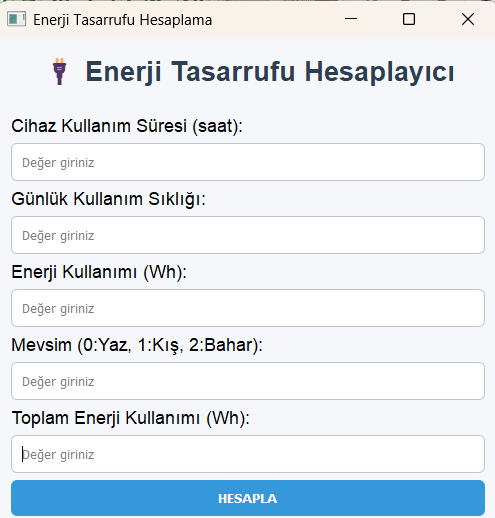
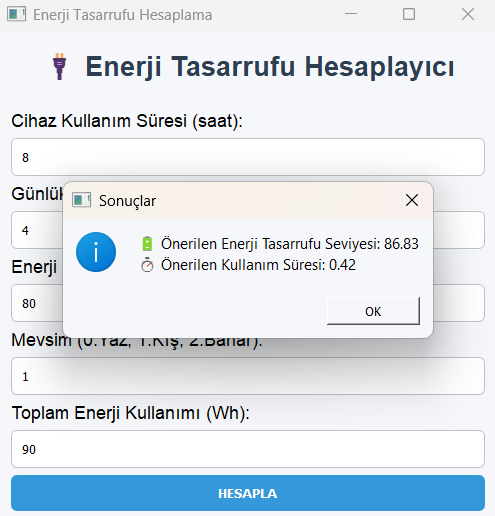
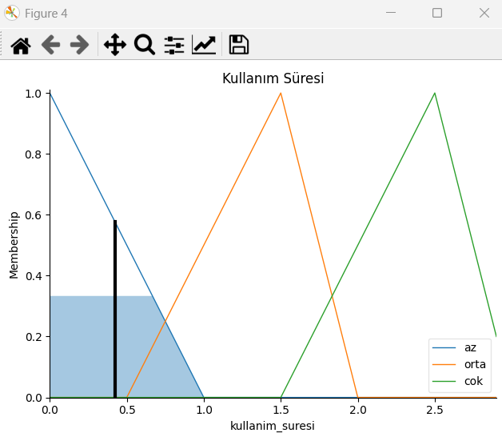
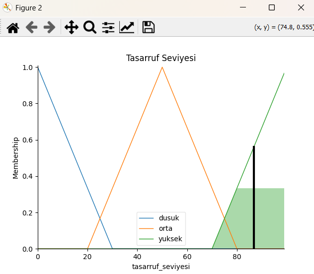

# 🔋 Enerji Tasarrufu için Bulanık Mantık Tabanlı Karar Destek Sistemi

Bu proje, enerji kullanımını optimize etmeye yarayan ve tasarruf sağlama amacıyla bulanık mantık sistemini kullanan bir karar destek sistemi geliştirmeyi amaçladım. Kullanıcının cihaz kullanım süresi, enerji tüketimi ve mevsim bilgisi gibi verilerine dayanarak **tasarruf seviyesi** ve **önerilen kullanım süresi** gibi çıktılarla sonuçlar elde ettim.

---

## 📌 Projenin Özellikleri

* Kullanıcı dostu grafiksel arayüz (PyQt5)
* 5 girdi üzerinden çalışan bulanık mantık modeli
* 2 adet çıktı: Enerji tasarruf seviyesi ve önerilen kullanım süresi
* Görsel grafik çıktıları (Matplotlib)
* Python ile yazılmış modüler ve yorumlanabilir bir yapı

---


## 🚀 Başlarken

### 1. Gerekli Kurulumlar

Projeyi çalıştırmadan önce aşağıdaki kütüphaneleri kurmanız gerekir:

```bash
pip install pyqt5 numpy matplotlib scikit-fuzzy
```

### 2. Çalıştırma

Visual Studio Code veya terminal üzerinden projenin bulunduğu klasörde şu komutu çalıştırın:

```bash
python main.py
```

---

## 🧐 Girdi ve Çıktı Bilgisi

### Girdiler:

* **Kullanım Sürezi (saat)**: Cihazın bir gün içinde çalıştığı süre
* **Günlük Kullanım Sıklığı**: Günde kaç kez kullanıldığı
* **Enerji Tüketimi (Wh)**: Cihazın tek kullanımdaki enerji tüketimi
* **Mevsim Bilgisi**: (0: Yaz, 1: Kış, 2: Bahar)
* **Toplam Enerji Tüketimi (Wh)**: Aylık veya haftalık toplam tüketim

### Çıktılar:

* 🔋 **Tasarruf Seviyesi (%):** Önerilen enerji tasarruf düzeyi
* ⏱️ **Önerilen Kullanım Süresi (saat):** Cihazın çalıştırılması gereken süre

---

## 📊 Örnek Çalışma

### Girdi:

```text
Kullanım Süresi: 8
Kullanım Sıklığı: 4
Enerji Kullanımı: 80
Mevsim: 1 (Kış)
Toplam Tüketim: 90
```



### Çıktı:

```text
🔋 Tasarruf Seviyesi: 86.83%
⏱️ Önerilen Kullanım Süresi: 0.42 saat
```



### Grafik:





---

## 🛠️ Kullanılan Teknolojiler

| Teknoloji    | Açıklama                    |
| ------------ | --------------------------- |
| Python       | Programlama dili            |
| PyQt5        | Grafiksel kullanıcı arayüzü |
| scikit-fuzzy | Bulanık mantık kütüphanesi  |
| matplotlib   | Grafik çizimi               |
| NumPy        | Sayısal işlemler            |

---

---
